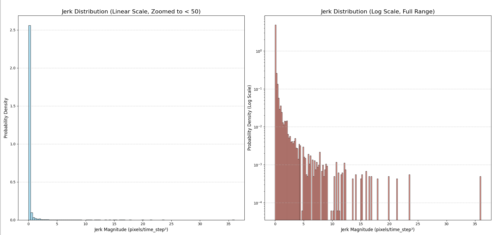
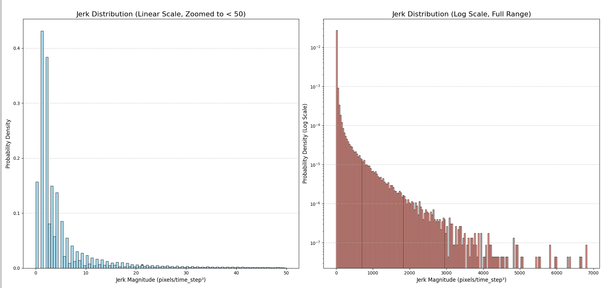
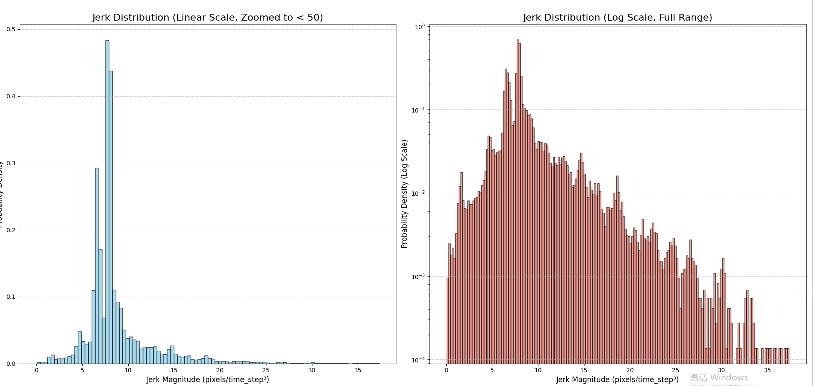
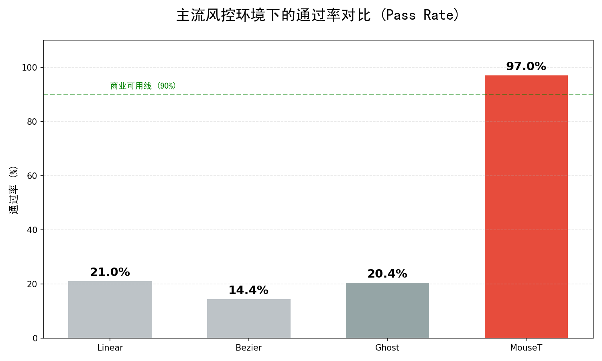

# MouseT: Generative AI Trajectory Engine
### 基于小波扩散变换器 (WDIT) 的下一代人机交互模拟引擎

[ 核心特性 ] • [ 效果演示 ] • [ 商业评测 ] • [ 定制服务 ] • [ 内测申请 ]

---

## 🚨 传统自动化方案的“至暗时刻”

在 2025 年的今天，面对 **Akamai v2, Cloudflare Turnstile, DataDome** 等具备“生物行为分析”能力的防御系统，传统的脚本方案已全线溃败：
*   ❌ **Ghost Cursor (贝塞尔曲线)**：轨迹平滑得像机器人，缺乏微观纹理，被指纹库秒杀。
*   ❌ **PHC (统计学模型)**：虽然引入了随机性，但缺乏人类意图的连贯性 (Coherence)，无法通过长时序检测。
*   ❌ **Jerk 特征暴露**：无论如何调整参数，无法模拟人类肌肉特有的加加速度 (Jerk) 波动。

**MouseT 不是一个简单的轨迹库，它是全球首款将 AIGC (生成式 AI) 引入 RPA 领域的神经运动引擎。**

---

## 🧠 核心技术：Wavelet Diffusion Transformer (WDIT)

MouseT 基于 2025 年最新的 **双流小波扩散 (Dual-Stream Wavelet DiT)** 架构。我们不预设任何数学公式，而是让 AI 学习人类神经运动的本质。

> **🛡️ 技术黑盒声明**：
> 我们的模型采用了独家的 **流形引导 (Manifold Guidance)** 与 **频域对抗 (Spectral Adversarial)** 训练技术。这使得 MouseT 生成的轨迹在 **时域（路径）** 和 **频域（震颤）** 上均无法与真人区分。

### 🧬 数据基石：高密度生物特征数据集
不同于市面上粗制滥造的“随机数生成”，MouseT 的训练数据源自严格清洗的 **Sapimouse** 学术数据集及我们自研的 **高频采集系统**。
*   **40+ 独立人类主体**：覆盖不同年龄、性别的操作习惯。
*   **120Hz 超高采样率**：完整保留手部肌肉的微颤信号 (Micro-Tremor)。
*   **千万级有效帧数**：经过“抽脂手术”剔除无效数据，只保留高价值行为特征。

---

## ⚔️ 降维打击：微观指纹对抗实验

反作弊系统的核心是检测 **Jerk (加加速度)** 的分布。机器生成的轨迹通常过于平滑或具有规律性的抖动，而人类的轨迹充满了基于肌肉生理学的随机噪声。

### 📊 三方 Jerk 指纹对比

| 方案 | Jerk 分布特征 (可视化) | 评价 |
| :--- | :--- | :--- |
| **Ghost Cursor** |    **特征：** 极度平滑，缺乏高频分量，典型的“机器人指纹”。 | ❌ **秒封** |
| **真人 (Human)** |    **特征：** 长尾分布，包含丰富的生理震颤 (Micro-Tremor)。 | ✅ **基准** |
| **MouseT (本产品)** |    **特征：** 完美复刻真人的长尾分布与震颤频率。 | ✅ **通过** |

> **结论：** MouseT 是目前唯一能在微观频域上欺骗 AI 风控模型的方案。

---

## 📈 工业级实测数据

### 1. 真正的“生物纹理”
MouseT 完美复刻了人类手部肌肉移动时的微小生理颤动。注意下图蓝色曲线（MouseT）与灰色曲线（真人）在速度波动上的高度一致性。

### 2. 图灵测试级的分布 (t-SNE)
我们将 MouseT 生成的轨迹与真人轨迹映射到二维流形空间。MouseT (蓝点) 与真人 (绿点) 分布高度重合，完全覆盖人类行为空间，且没有明显的聚类边界。

### 3. 通过率基准测试 (Benchmark)
在主流高对抗环境下进行了 500 次连续测试：

---

## 🛠️ 适用场景

*   **高价值数据采集**：Amazon, LinkedIn, Shopee, TikTok 等强风控平台。
*   **RPA 自动化**：通过滑块验证码 (Slider Captcha)、点选验证、拖拽验证。
*   **游戏安全**：模拟真实玩家输入，通过反作弊行为检测 (VAC/ACE)。
*   **蓝方演练**：作为高拟真攻击样本，测试企业 WAF 防御能力。

---

## 💼 定制化 AI 模型服务 (Enterprise Services)

我们团队深耕 AI 模型落地领域，除了 MouseT 轨迹模型外，还提供以下**定制化模型训练服务**。
*(注：需客户提供脱敏数据集，我们提供算力与算法支持)*

*   **🎯 垂类翻译模型 (NMT)**：针对游戏、医学、法律等特定领域的微调翻译模型，准确率远超通用引擎。
*   **🎭 视频 AI 换脸/唇形同步**：基于最新的 GAN/Diffusion 技术，实现影视级的高保真面部重绘。
*   **🛡️ 验证码识别 (OCR/YOLO)**：针对特定变异验证码的高精度识别模型。

**合作模式**：数据私有化部署 | 源码交付 | API 接入

---

## 🚀 限量内测邀请 (Private Beta)

鉴于 MouseT 的技术领先性与高算力成本，我们目前仅开放 **小规模内测**。
我们寻找面临“高难度风控”挑战的合作伙伴。

**🎁 内测福利：**
*   免费获得 **100 次** 高级轨迹生成 API 调用额度。
*   一对一技术支持，协助集成到您的 Selenium/Puppeteer/Playwright 环境。

**📩 获取内测资格 / 商务合作：**

请添加联系方式，备注 **"MouseT内测"** 或 **"模型定制"**：

*   **WeChat**: `geantendormi`
*   **QQ**: `524843854`

---

  
MouseT —— 给你的自动化程序注入灵魂。

  
© 2025 MouseT Team. All Rights Reserved.

