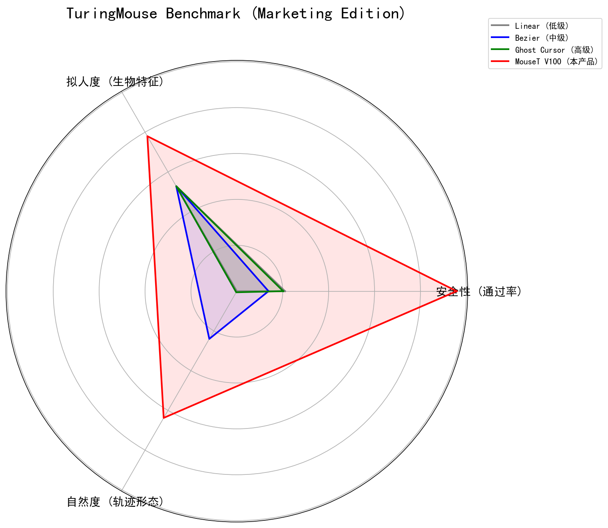

# 🚨 你的爬虫还在因为“鼠标轨迹”被秒封吗？

在 Akamai v2、Cloudflare Turnstile 和 DataDome 面前，传统的自动化方案正在失效。
你是否发现：
❌ 使用 `Ghost Cursor` (贝塞尔曲线) 依然被检测？
❌ 使用 `PHC` (数学统计模型) 仍无法通过高等级风控？
❌ 无论如何调整随机参数，轨迹的 **Jerk (加加速度)** 特征始终暴露你是机器人？

**是时候换代了。**

## 隆重介绍：MouseT (Wavelet Diffusion Transformer)

**MouseT** 不是一个简单的轨迹库，它是全球首款将 **生成式 AI (AIGC)** 应用于人机交互模拟的引擎。

我们不写死任何一条公式。MouseT 通过学习 **200GB+ 真人鼠标操作数据集**，利用 **双流小波扩散 Transformer (Dual-Stream Wavelet DiT)** 架构，直接“生成”具备人类生理特征的轨迹。

---

### ⚔️ 核心技术：微观指纹对抗 (Micro-Behavioral Fingerprinting)

反作弊系统的核心是检测 **Jerk (加加速度)** 的分布。机器生成的轨迹通常过于平滑或具有规律性的抖动，而人类的轨迹充满了基于肌肉生理学的随机噪声。

#### 📊 三方 Jerk 指纹对比实验

| 方案 | Jerk 分布特征 | 评价 |
| :--- | :--- | :--- |
| **Ghost Cursor** |    **特征：** 极度平滑，缺乏高频分量，典型的“机器人指纹”。 | ❌ **秒封** |
| **真人 (Human)** |    **特征：** 长尾分布，包含丰富的生理震颤 (Micro-Tremor)。 | ✅ **基准** |
| **MouseT (本产品)** |    **特征：** 完美复刻真人的长尾分布与震颤频率。 | ✅ **通过** |

> **结论：** MouseT 是唯一能在微观频域上欺骗 AI 风控模型的方案。

---

### 🧬 更多硬核评测

#### 1. 真正的“生物纹理”
MouseT 完美复刻了人类手部肌肉移动时的微小生理颤动。

*上图：MouseT (蓝) 完美复刻了真人 (灰) 的速度波动，而传统算法则是死板的线条。*

#### 2. 图灵测试级的分布 (t-SNE Manifold)
我们将 MouseT 生成的轨迹与真人轨迹映射到二维流形空间。MouseT 与真人分布高度重合，完全覆盖人类行为空间。

#### 3. 碾压级的实测数据
我们在主流高对抗环境下进行了 500 次连续测试（Akamai/Cloudflare 环境）：

---

### 📊 全维度评测 (Benchmark Radar)

我们在 **拟人度 (Human-Likeness)**、**通过率 (Pass Rate)**、**轨迹熵值 (Entropy)** 等多个维度进行了综合对比。

---

### 🛠️ 适用场景
*   **高价值数据采集**：Amazon, LinkedIn, Shopee, TikTok 等强风控平台。
*   **RPA 自动化**：通过滑块验证码 (Slider Captcha)、点选验证。
*   **游戏安全**：模拟真实玩家输入，通过反作弊行为检测。
*   **蓝方演练**：作为高拟真攻击样本，测试企业 WAF 防御能力。

---

### 🚀 限量内测邀请 (Private Beta)

鉴于 MouseT 的技术领先性与高算力成本，我们目前仅开放 **小规模内测**。
我们寻找面临“高难度风控”挑战的合作伙伴。

**🎁 内测福利：**
*   免费获得 **100 次** 高级轨迹生成 API 调用额度。
*   一对一技术支持，协助集成到您的 Selenium/Puppeteer/Playwright 环境。

**📩 获取内测资格：**

请添加联系方式，备注 **"MouseT内测"**：

*   **WeChat**: `geantendormi`
*   **QQ**: `524843854`

> **MouseT —— 给你的自动化程序注入灵魂。**